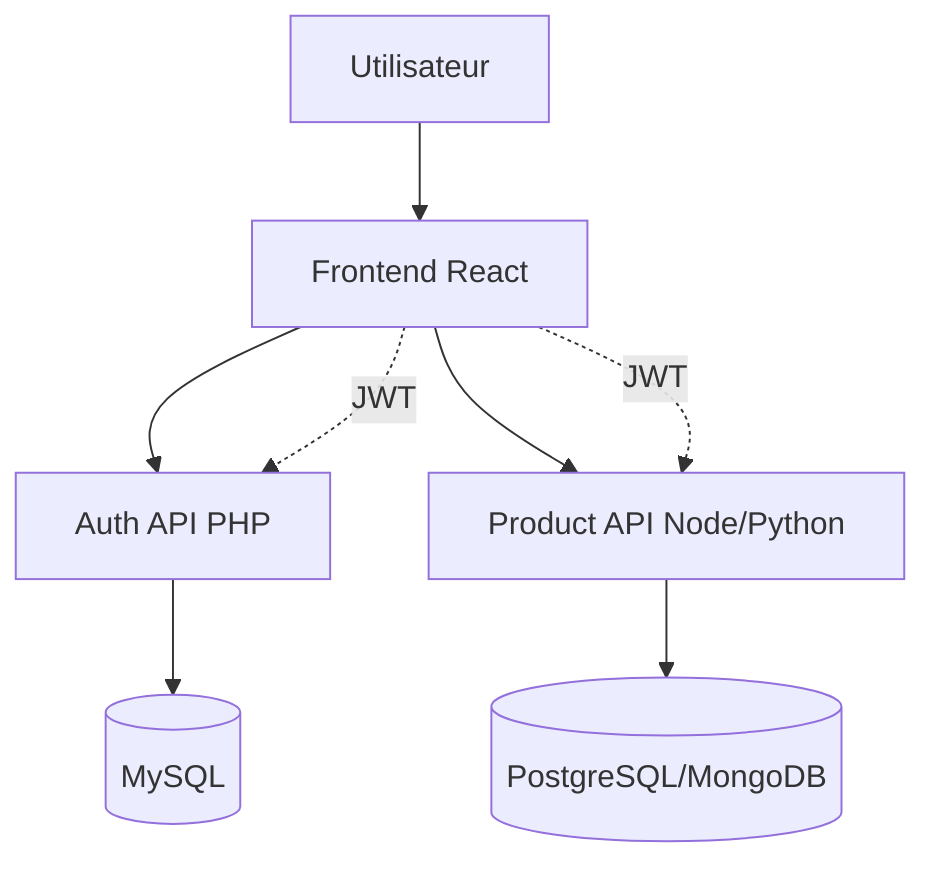

# Documentation Architecture

## Description
Documentation technique de l'architecture de l'application DevOpsCorp.

## Contenu à créer

### 1. Schéma d'architecture globale
- Vue d'ensemble du système
- Microservices et leurs interactions
- Flux de données
- Schéma réseau

### 2. Architecture applicative

#### Frontend
- Structure des composants React
- Gestion de l'état
- Routing
- Communication avec les APIs

#### Backend
- Architecture des APIs
- Modèles de données
- Authentification et autorisation
- Gestion des erreurs

### 3. Architecture d'infrastructure

#### Développement
- Docker Compose
- Services locaux
- Bases de données de développement

#### Production
- Cloud provider choisi
- Load balancing
- Haute disponibilité
- Sauvegarde et récupération

### 4. Sécurité
- Authentification (JWT)
- Autorisation (RBAC)
- Chiffrement (HTTPS, données sensibles)
- Gestion des secrets
- Protection contre les attaques (CSRF, XSS, injection SQL...)

### 5. Schémas à créer

Fichiers à ajouter :
- `architecture-overview.png` - Vue globale
- `microservices-diagram.png` - Architecture microservices
- `data-flow.png` - Flux de données
- `network-topology.png` - Topologie réseau
- `ci-cd-pipeline.png` - Pipeline CI/CD
- `deployment-architecture.png` - Architecture de déploiement

## Outils de diagrammes recommandés
- Draw.io / diagrams.net
- Lucidchart
- PlantUML
- Mermaid (intégré dans Markdown)

## Exemple de diagramme Mermaid

## À créer
- [ ] Schéma d'architecture globale
- [ ] Documentation des microservices
- [ ] Diagrammes de flux
- [ ] Schémas d'infrastructure
- [ ] Documentation de sécurité
- [ ] Modèles de données
