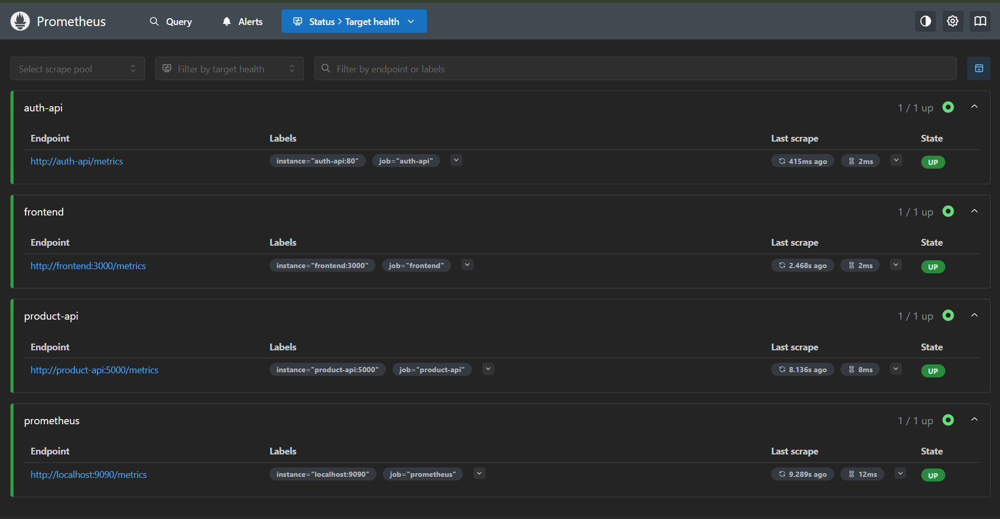
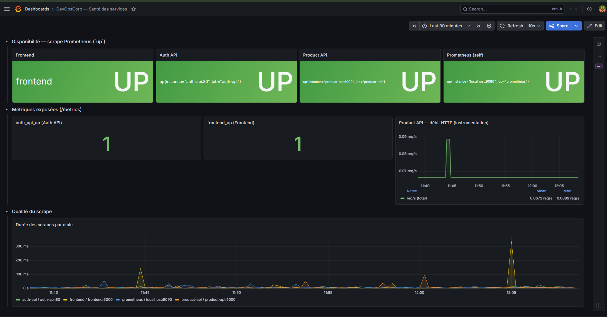

# Supervision — Prometheus et Grafana

Configuration locale du monitoring : **collecte** des métriques (Prometheus) et **visualisation** (Grafana), orchestrés via Docker Compose.

## Arborescence

```
infra/monitoring/
├── README.md                    # Ce fichier
├── prometheus.yml               # Jobs de scrape (targets, intervalles)
└── grafana/
    └── provisioning/
        ├── datasources/
        │   └── prometheus.yml   # Datasource « Prometheus » → http://prometheus:9090
        └── dashboards/
            ├── dashboard.yml # Chargement automatique des JSON
            └── devopscorp-health.json  # Dashboard « Santé des services »
```

Les captures d’écran pour la doc se trouvent sous **`docs/monitoring/screenshots/`** (voir `docs/monitoring/README.md`).

## Démarrage rapide

À la racine du dépôt :

```bash
docker compose up -d prometheus grafana
```

Avec toute la stack applicative :

```bash
docker compose up -d
```

| Service    | URL locale | URL production (Render) | Identifiants Grafana |
|-----------|-------------------------|------------------------|----------------------|
| Prometheus | <http://localhost:9090> | <https://docorps-prometheus.onrender.com/> | — |
| Grafana    | <http://localhost:3001> | <https://docorps-grafana.onrender.com/> | `admin` / valeur de `GRAFANA_ADMIN_PASSWORD` (Render) ou `admin` (local) |

> En production, Prometheus et Grafana sont déployés via [`infra/terraform/render/`](../terraform/render/) avec des images custom (`Dockerfile.prometheus`, `Dockerfile.grafana`) embarquant la configuration. Le scrape utilise alors [`prometheus-render.yml`](prometheus-render.yml) (cibles publiques `docorps-*.onrender.com`) et **non** `prometheus.yml` (réservé au scrape interne Docker).

Variables utiles dans `.env` :

```env
GRAFANA_ADMIN_USER=admin
GRAFANA_ADMIN_PASSWORD=votre-mot-de-passe
```

## Prometheus — Cibles scrapées

| Job | Cible dans Docker | Chemin   | Rôle |
|---------------|---------------------|----------|------|
| `prometheus`  | `localhost:9090`   | `/metrics` | Auto-monitoring |
| `product-api` | `product-api:5000` | `/metrics` | FastAPI + instrumentation Prometheus |
| `auth-api`    | `auth-api:80`      | `/metrics` | Métrique `auth_api_up` |
| `frontend`    | `frontend:3000`    | `/metrics` | Stage **dev** (Vite) ; en image Nginx seule, le port interne est **80** (adapter `prometheus.yml` et le mapping Compose si besoin). |

Vérification : **Status → Targets** — [http://localhost:9090/targets](http://localhost:9090/targets).

### Aperçu (capture)



*Si l’image ne s’affiche pas : ajoutez `docs/monitoring/screenshots/prometheus-targets.png` (voir `docs/monitoring/README.md`).*

## Grafana — Dashboard provisionné

1. Ouvrir [http://localhost:3001](http://localhost:3001) et se connecter.
2. **Dashboards** → **DevOpsCorp — Santé des services** (uid `devopscorp-health`).

Contenu principal : métrique **`up`** par job, **`auth_api_up`** / **`frontend_up`**, débit HTTP sur la Product API (`http_requests_total`), durée des scrapes.

Après modification du JSON du dashboard : `docker compose restart grafana`.

### Aperçu (capture)



*Si l’image ne s’affiche pas : ajoutez `docs/monitoring/screenshots/grafana-dashboard-sante.png`.*

### Dashboards communautaires

**Dashboards → Import** : coller un ID Grafana (ex. Node Exporter `1860`) et choisir la datasource **Prometheus**.

## Dépannage

### Target `frontend` en erreur (`connection refused` sur `:3000`)

Le `docker-compose` doit construire le frontend en stage **`dev`** (`build.target: dev`) pour que Vite écoute sur **3000**. Si l’image utilisée est uniquement **Nginx** (port **80**), mettre à jour `prometheus.yml` (`frontend:80`) et le mapping des ports dans Compose.

### Grafana : « No data » alors que Prometheus est correct

1. **Explore** → datasource **Prometheus** → requête `up` : des séries doivent apparaître.
2. Le dashboard référence la datasource par **nom** : **`Prometheus`** (casse exacte), comme dans le fichier provisionné `datasources/prometheus.yml`.
3. En cas d’ancienne config manuelle en conflit, réinitialiser le volume Grafana puis relancer :

   ```bash
   docker compose stop grafana
   docker volume rm devopscorp-grafana-data
   docker compose up -d grafana
   ```

   *(Le nom du volume peut varier : `docker volume ls`.)*
